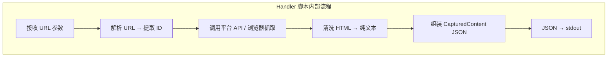
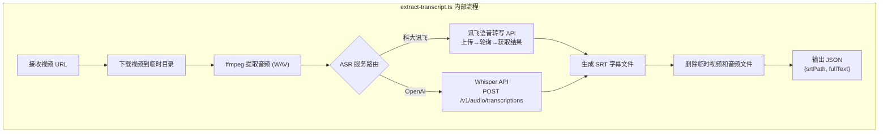
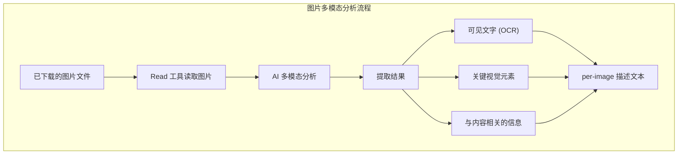
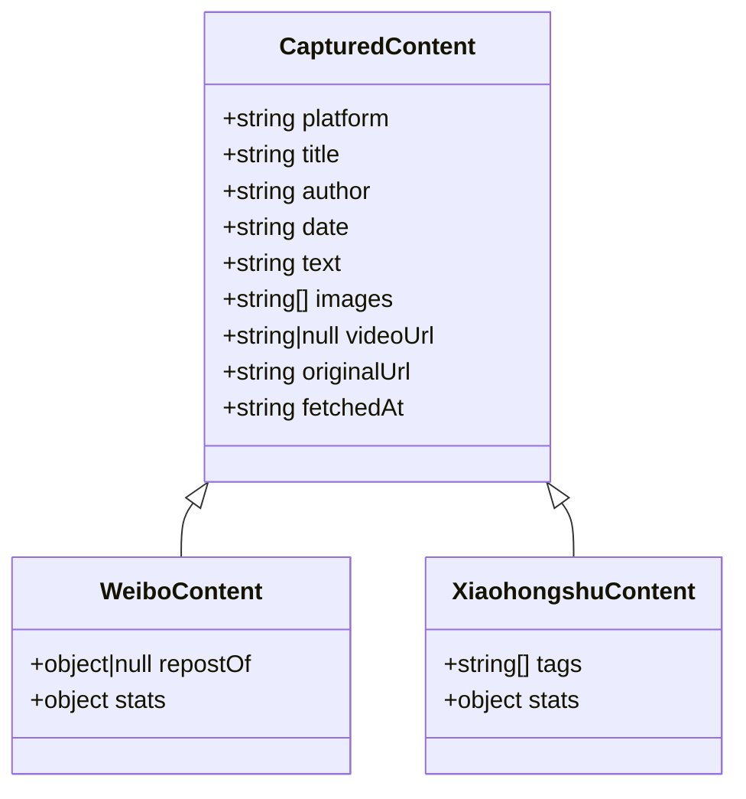
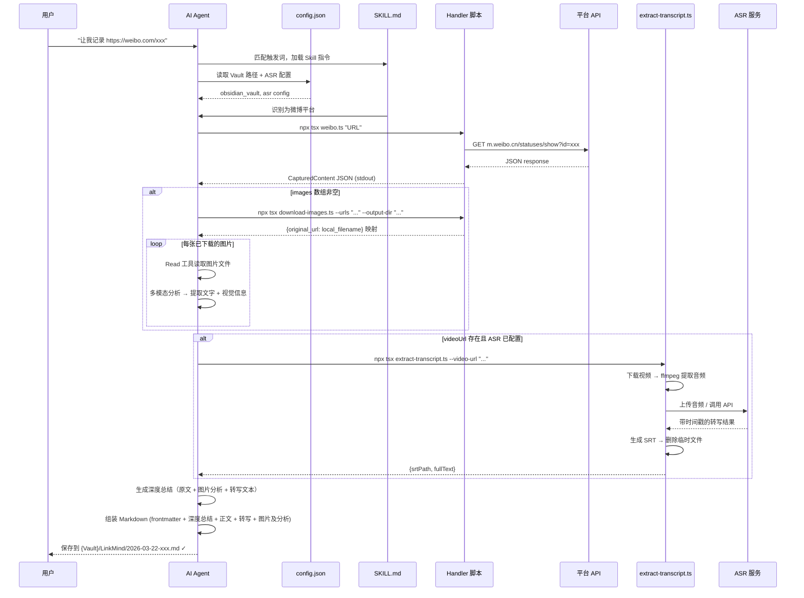
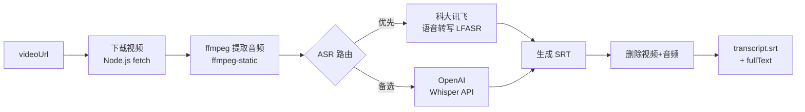
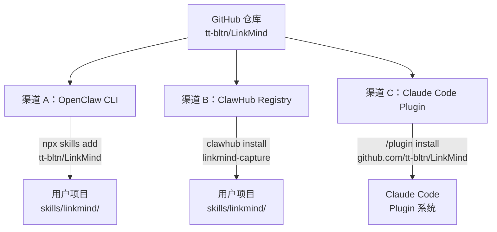
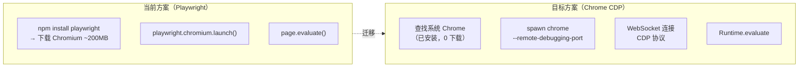

# LinkMind — 架构文档 (ARCH)

## 1. 系统概览

LinkMind 是一个 AI Agent Skill，采用 **SKILL.md + Handler 脚本** 的混合架构。
AI 负责意图识别、深度总结和文件生成，Handler 脚本负责平台抓取和数据结构化。
笔记输出到用户配置的 Obsidian Vault，与用户已有的知识库无缝融合。

```mermaid
flowchart LR
    User["用户输入链接"] --> Agent["AI Agent"]
    Agent --> Config["读取 config.json<br/>获取 Vault 路径 + ASR 配置"]
    Config --> Skill["SKILL.md<br/>工作流指令"]
    Skill --> Dispatch{"识别平台"}
    Dispatch -->|weibo.com| WeiboHandler["weibo.ts"]
    Dispatch -->|xiaohongshu.com| XhsHandler["xiaohongshu.ts"]
    WeiboHandler --> JSON["结构化 JSON"]
    XhsHandler --> JSON
    JSON --> ImgDL["download-images.ts<br/>图片下载到 Vault"]
    ImgDL --> ImgAnalyze["AI 多模态分析<br/>读取图片 → 提取内容"]
    ImgAnalyze --> HasVideo{"含视频?<br/>且 ASR 已配置?"}
    HasVideo -->|是| Transcript["extract-transcript.ts<br/>视频→音频→ASR→SRT"]
    HasVideo -->|否| Agent2["AI Agent"]
    Transcript --> Agent2
    Agent2 --> Markdown["生成 Markdown<br/>含深度总结 + 图片分析 + 转写文本"]
    Markdown --> File["写入 Obsidian Vault<br/>LinkMind/"]
    File --> Report["向用户报告结果"]
```




## 2. 组件职责

### 2.1 SKILL.md — AI 工作流指令


| 职责          | 说明                                             |
| ----------- | ---------------------------------------------- |
| 意图触发        | 识别"让我记录"等触发词                                   |
| 配置读取        | 读取 `config.json`，获取用户 Obsidian Vault 路径        |
| 平台分发        | 根据 URL 模式判断调用哪个 handler                        |
| 深度总结        | 基于 handler 输出的 JSON 生成深度总结（核心观点、关键信息、背景脉络、价值点） |
| Markdown 生成 | 按模板格式组装 frontmatter + 正文                       |
| 文件写入        | 命名和保存到 Obsidian Vault 的 `LinkMind/` 子目录        |
| 错误处理        | 向用户报告失败原因和建议                                   |


### 2.2 Handler 脚本 — 平台抓取

每个 handler 是一个独立的 TypeScript 脚本，通过 CLI 调用，输入 URL，输出 JSON。




| handler          | 抓取方式                        | 依赖               |
| ---------------- | --------------------------- | ---------------- |
| `weibo.ts`       | `m.weibo.cn` 移动端 JSON API   | Node.js 内置 fetch |
| `xiaohongshu.ts` | Playwright headless browser | playwright       |


### 2.3 视频转写脚本 — extract-transcript.ts

独立的 TypeScript 脚本，接收视频 URL，输出 SRT 字幕文件和纯文本。




| 步骤          | 工具               | 说明                                   |
| ----------- | ---------------- | ------------------------------------ |
| 视频下载        | Node.js fetch    | 下载到系统临时目录                            |
| 音频提取        | ffmpeg-static    | 提取为 WAV 格式，适配 ASR 输入要求               |
| ASR（科大讯飞）   | 语音转写 API (LFASR) | 支持长音频，返回带时间戳的分段结果                    |
| ASR（OpenAI） | Whisper API      | `response_format=verbose_json` 获取时间戳 |
| SRT 生成      | 内部逻辑             | 将 ASR 时间戳结果格式化为标准 SRT                |
| 清理          | Node.js fs       | 删除临时视频和音频文件                          |


**CLI 接口：**

```bash
npx tsx extract-transcript.ts \
  --video-url "<VIDEO_URL>" \
  --output-dir "{attachments directory}" \
  --config skills/linkmind/config.json \
  --referer "<platform homepage>"
```

**输出（stdout JSON）：**

```json
{
  "srtPath": "attachments/{date}-{slug}/transcript.srt",
  "fullText": "视频转写的完整纯文本..."
}
```

失败时输出 `HandlerError` 格式的 JSON（含 `error` / `code` / `details` 字段）。

### 2.4 图片多模态分析 — AI Agent 内置能力

AI Agent 在图片下载完成后，利用自身的多模态能力逐张分析图片内容。
此步骤完全在 SKILL.md 工作流中完成，无需独立的 handler 脚本。




| 步骤   | 工具               | 说明                    |
| ---- | ---------------- | --------------------- |
| 读取图片 | AI Agent Read 工具 | 支持 JPEG/PNG/GIF/WebP  |
| 内容分析 | AI Agent 多模态能力   | 提取文字、视觉元素、相关信息        |
| 结果输出 | SKILL.md 模板      | blockquote 形式附加在每张图片后 |
| 总结集成 | AI Agent         | 图片分析内容作为深度总结的补充输入     |


**特点：**

- 零外部依赖：完全利用 AI Agent 自身能力，无需配置 API 密钥
- 逐张独立分析：单张失败不影响其他图片
- 聚焦信息价值：优先提取有意义的文字和数据，简要描述视觉场景

### 2.5 类型系统 — types.ts

所有 handler 共享 `CapturedContent` 接口，确保输出格式统一。
各平台可扩展为子类型（`WeiboContent`、`XiaohongshuContent`），
携带平台特有字段（如微博的转发信息、小红书的标签）。




## 3. 技术选型


| 决策           | 选择                          | 理由                             |
| ------------ | --------------------------- | ------------------------------ |
| 扩展形式         | Skill（非 Plugin）             | 跨平台兼容、轻量、工作流天然适配               |
| 语言           | TypeScript                  | 类型安全、Node.js 生态丰富              |
| TS 运行器       | tsx                         | 零配置、快速、无需编译步骤                  |
| 微博抓取         | m.weibo.cn 移动端 API          | 无需登录、返回 JSON、轻量                |
| 小红书抓取        | Playwright                  | 反爬严格需要浏览器渲染                    |
| 音频提取         | ffmpeg-static (npm)         | 静态二进制，npm install 自动安装，无需系统级依赖 |
| ASR — 科大讯飞   | 语音转写 (LFASR)                | 中文识别质量高，支持长音频，带时间戳             |
| ASR — OpenAI | Whisper API                 | 多语言支持好，API 简洁，作为备选             |
| 字幕格式         | SRT                         | 最通用的字幕格式，纯文本、易解析、工具生态丰富        |
| 输出格式         | Markdown + YAML frontmatter | 通用、可搜索、Obsidian 原生兼容           |
| 输出目标         | 用户 Obsidian Vault           | 与已有知识库融合、支持双向链接和图谱             |
| 用户配置         | config.json                 | 轻量、无需额外依赖、AI 可直接读取             |


## 4. 数据流




## 5. 目录结构

```
LinkMind/
├── skills/linkmind/
│   ├── SKILL.md              # AI 读取的工作流指令
│   ├── config.json           # 用户配置（Vault 路径、Cookie、ASR 等）
│   ├── handlers/
│   │   ├── package.json      # handler 依赖（含 ffmpeg-static）
│   │   ├── tsconfig.json     # TypeScript 配置
│   │   ├── types.ts          # 共享类型定义
│   │   ├── config.ts         # 统一配置读取
│   │   ├── retry.ts          # 重试逻辑
│   │   ├── weibo.ts          # 微博 handler
│   │   ├── xiaohongshu.ts    # 小红书 handler
│   │   ├── download-images.ts # 图片下载
│   │   └── extract-transcript.ts  # 视频转写（音频提取 + ASR + SRT 生成）
│   └── templates/
│       └── note.md           # Markdown 模板参考
├── docs/                     # 项目文档
├── package.json              # 根项目配置
└── .gitignore

用户 Obsidian Vault（输出目标）：
{obsidian_vault}/
└── LinkMind/                 # 由 Skill 自动创建
    ├── 2026-03-22-xxx.md     # 抓取的笔记
    └── attachments/
        └── 2026-03-22-xxx/   # 每篇笔记一个子目录
            ├── img-001.jpg   # 图片附件
            ├── img-002.png
            └── transcript.srt # 视频转写字幕（如有视频）
```

## 6. 扩展点

### 新增平台

1. 在 `handlers/` 下新建 `{platform}.ts`
2. 实现 URL 解析 + 内容抓取 + 输出 `CapturedContent` JSON
3. 在 `SKILL.md` 中添加平台 URL 模式和调用指令
4. 在 `types.ts` 中新增平台子类型（如需要）

### 视频 ASR 转写（P1）

作为独立脚本 `extract-transcript.ts` 实现，由 SKILL.md 在 handler 输出含 `videoUrl` 时调用。




**ASR 服务路由逻辑：**

1. 读取 `config.json` 的 `asr` 配置
2. 根据 `asr.provider` 确定优先服务（默认 `iflytek`）
3. 优先服务有完整配置 → 使用优先服务
4. 优先服务未配置或调用失败 → fallback 到另一个已配置的服务
5. 均未配置 → 返回错误，SKILL.md 跳过转写步骤

**SRT 格式示例：**

```srt
1
00:00:00,000 --> 00:00:05,230
大家好，今天给大家分享一下成都的美食推荐

2
00:00:05,230 --> 00:00:12,100
第一家推荐的是春熙路附近的一家火锅店
```

### 图片本地化（P1）

在 handler 中增加图片下载逻辑，或在 SKILL.md 中指导 AI 使用 curl 下载。
图片保存到 Obsidian Vault 的 `LinkMind/attachments/{date}-{slug}/` 子目录，
Markdown 中使用相对路径引用，确保 Obsidian 内可正常显示。

## 7. 分发与安装架构（Step 7）

### 7.1 分发渠道

LinkMind 作为一个 SKILL.md 标准的 AI Agent Skill，支持三条安装渠道，
仓库本身即为可分发单元，无需发布到 npm。




| 渠道                 | 安装命令                                       | 机制                                      |
| ------------------ | ------------------------------------------ | --------------------------------------- |
| OpenClaw CLI       | `npx skills add tt-bltn/LinkMind`          | 从 GitHub 拉取 skill 目录                    |
| ClawHub Registry   | `clawhub install linkmind-capture`         | 从 ClawHub 注册表下载已发布的 skill               |
| Claude Code Plugin | `/plugin install https://github.com/tt-bltn/LinkMind` | 通过 `.claude-plugin/plugin.json` 注册 |


### 7.2 Skill 自包含化

分发后 `skills/linkmind/` 必须可独立运行。关键改动：

```
skills/linkmind/                 # 可独立分发的单元
├── SKILL.md                     # AI 指令（含 metadata.openclaw）
├── config.template.json         # 配置模板（不含真实值）
├── scripts/                     # 重命名自 handlers/
│   ├── package.json
│   ├── types.ts
│   ├── config.ts
│   ├── retry.ts
│   ├── weibo.ts
│   ├── xiaohongshu.ts
│   ├── download-images.ts
│   └── extract-transcript.ts
├── references/                  # SKILL.md 拆分出的参考文档
│   └── deep-summary-guide.md
└── templates/
    └── note.md
```

### 7.3 Chrome CDP 替代 Playwright

小红书抓取从 Playwright 迁移到 Chrome DevTools Protocol，消除 Chromium 下载依赖。




**CDP 核心模块职责：**


| 模块        | 功能                                                                             |
| --------- | ------------------------------------------------------------------------------ |
| Chrome 查找 | 按平台扫描已知路径（macOS/Windows/Linux），定位 Chrome 可执行文件                                 |
| CDP 连接    | 启动 Chrome → 等待 debug port 就绪 → WebSocket 连接                                    |
| 页面操作      | `Runtime.evaluate`（执行 JS）、`Page.navigate`、`Input.dispatchMouseEvent`           |
| 反检测注入     | `Page.addScriptToEvaluateOnNewDocument` 注入 `navigator.webdriver = undefined` 等 |


**Chrome 查找路径（按平台）：**


| 平台      | 候选路径                                                             |
| ------- | ---------------------------------------------------------------- |
| macOS   | `/Applications/Google Chrome.app/Contents/MacOS/Google Chrome` 等 |
| Windows | `C:\Program Files\Google\Chrome\Application\chrome.exe` 等        |
| Linux   | `/usr/bin/google-chrome`, `/usr/bin/chromium` 等                  |


### 7.4 配置体系演进


| 配置项      | 当前                  | Step 7 目标                    |
| -------- | ------------------- | ---------------------------- |
| Vault 路径 | `config.json`       | `config.json`（保持，由安装工具从模板生成） |
| Cookies  | `config.json`       | `.env` 文件（敏感信息不进版本控制）        |
| ASR 密钥   | `config.json`       | `.env` 文件                    |
| 仓库中的配置   | `config.json`（含真实值） | `config.template.json`（仅模板）  |


**配置优先级：**

```
项目级 .env → 用户级 ~/.linkmind/.env
项目级 config.json → 用户级 ~/.linkmind/config.json
```

