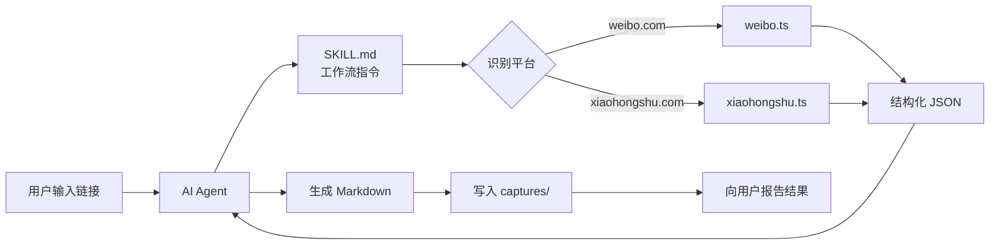
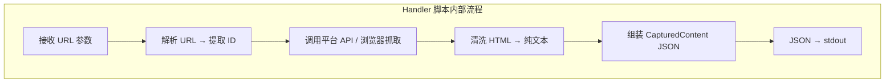
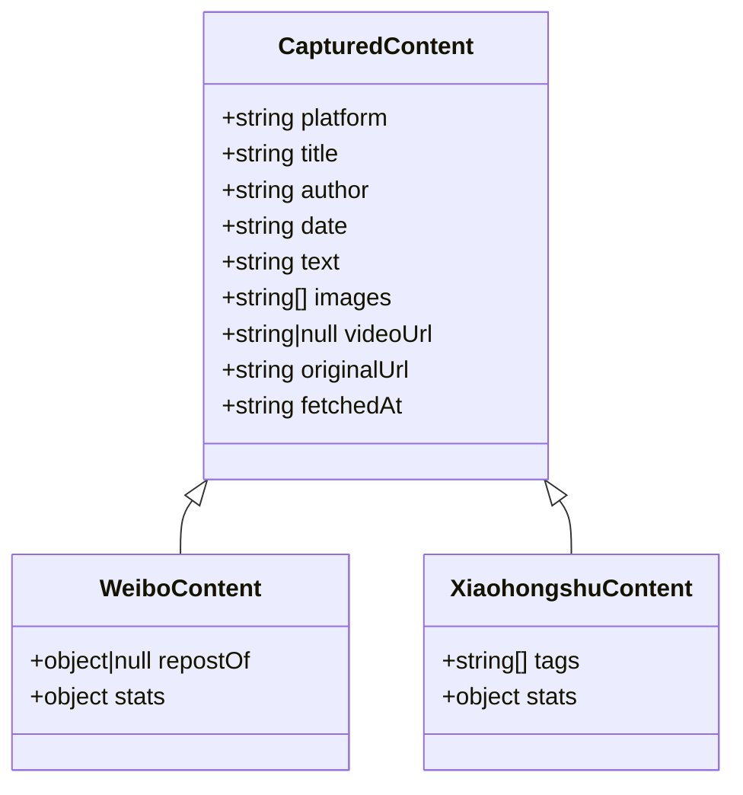
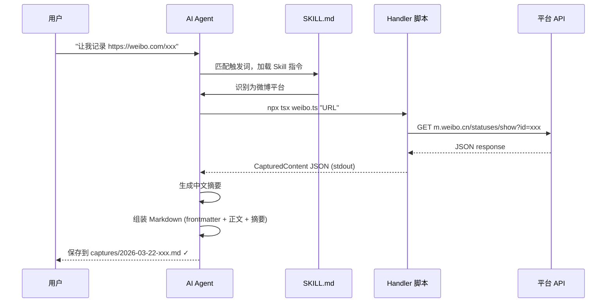

# LinkMind — 架构文档 (ARCH)

## 1. 系统概览

LinkMind 是一个 AI Agent Skill，采用 **SKILL.md + Handler 脚本** 的混合架构。
AI 负责意图识别、内容总结和文件生成，Handler 脚本负责平台抓取和数据结构化。



## 2. 组件职责

### 2.1 SKILL.md — AI 工作流指令

| 职责 | 说明 |
|------|------|
| 意图触发 | 识别"让我记录"等触发词 |
| 平台分发 | 根据 URL 模式判断调用哪个 handler |
| 内容总结 | 基于 handler 输出的 JSON 生成中文摘要 |
| Markdown 生成 | 按模板格式组装 frontmatter + 正文 |
| 文件写入 | 命名和保存到 captures/ 目录 |
| 错误处理 | 向用户报告失败原因和建议 |

### 2.2 Handler 脚本 — 平台抓取

每个 handler 是一个独立的 TypeScript 脚本，通过 CLI 调用，输入 URL，输出 JSON。



| handler | 抓取方式 | 依赖 |
|---------|---------|------|
| `weibo.ts` | `m.weibo.cn` 移动端 JSON API | Node.js 内置 fetch |
| `xiaohongshu.ts` | Playwright headless browser | playwright |

### 2.3 类型系统 — types.ts

所有 handler 共享 `CapturedContent` 接口，确保输出格式统一。
各平台可扩展为子类型（`WeiboContent`、`XiaohongshuContent`），
携带平台特有字段（如微博的转发信息、小红书的标签）。



## 3. 技术选型

| 决策 | 选择 | 理由 |
|------|------|------|
| 扩展形式 | Skill（非 Plugin） | 跨平台兼容、轻量、工作流天然适配 |
| 语言 | TypeScript | 类型安全、Node.js 生态丰富 |
| TS 运行器 | tsx | 零配置、快速、无需编译步骤 |
| 微博抓取 | m.weibo.cn 移动端 API | 无需登录、返回 JSON、轻量 |
| 小红书抓取 | Playwright | 反爬严格需要浏览器渲染 |
| 输出格式 | Markdown + YAML frontmatter | 通用、可搜索、Git 友好 |

## 4. 数据流



## 5. 目录结构

```
LinkMind/
├── skills/linkmind/
│   ├── SKILL.md              # AI 读取的工作流指令
│   ├── handlers/
│   │   ├── package.json      # handler 依赖
│   │   ├── tsconfig.json     # TypeScript 配置
│   │   ├── types.ts          # 共享类型定义
│   │   ├── weibo.ts          # 微博 handler
│   │   └── xiaohongshu.ts    # 小红书 handler
│   └── templates/
│       └── note.md           # Markdown 模板参考
├── captures/                 # 输出目录
├── docs/                     # 项目文档
├── package.json              # 根项目配置
└── .gitignore
```

## 6. 扩展点

### 新增平台

1. 在 `handlers/` 下新建 `{platform}.ts`
2. 实现 URL 解析 + 内容抓取 + 输出 `CapturedContent` JSON
3. 在 `SKILL.md` 中添加平台 URL 模式和调用指令
4. 在 `types.ts` 中新增平台子类型（如需要）

### 视频处理（P1）

```
视频 URL → ffmpeg 下载 → ffmpeg 提取音频 → Whisper API 转文字 → 合入 text 字段
```

可作为独立 handler 或在现有 handler 中扩展。

### 图片本地化（P1）

在 handler 中增加图片下载逻辑，或在 SKILL.md 中指导 AI 使用 curl 下载。
图片保存到 `captures/images/{date}-{slug}/` 子目录。
